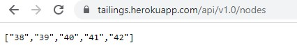
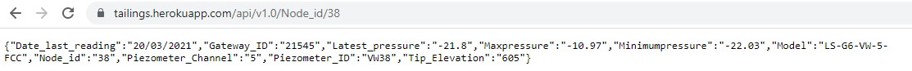
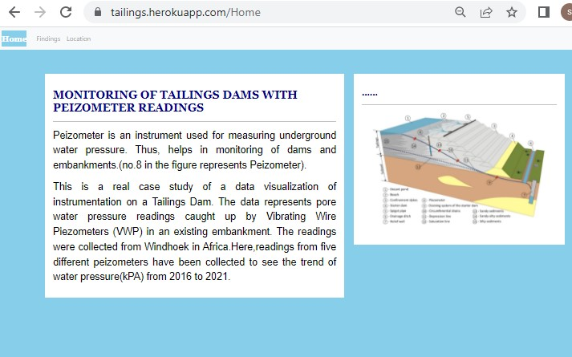
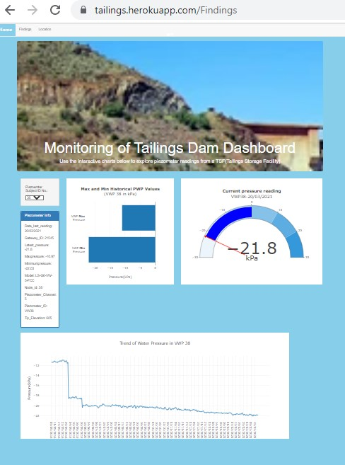
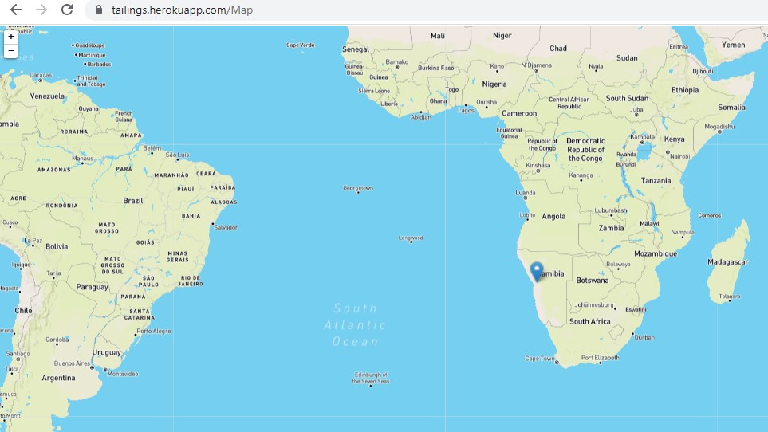

# Monitoring of Tailings Dam with Peizometer Readings
https://tailings.herokuapp.com/Home

Team Members : Masi Maipye, Roxana Ugaz and Shreestina Tamrakar

Our project is based on a real case study of data visualisation of istrumentation on a Tailings Dam in a mine in Namibia(southern part of Africa). A tailings dam is typically an earth-fill embankment dam used to store byproducts of mining operations after separating the ore from the commercially valueless material. The importance of this project lies in the use of Peizometer which is an instrument which measures water pressure and helps consultants and engineers to verify their design and prove the behaviour of a structure is performing as expected and to prevent the potential risks of Dam Break failures.

## Research Scope
* To build an interactive dashboard to track water pressure readings from peizometer in a tailings dam.
* This information is related to safety in a mining infrastructure. The target market related to the project is the engineering or mining area.

## Data Source
* Data is collected from private client directly from API linked to the equipment on site and the source cannot be revealed due to privacy issue
* A total of 1756 Pressure water readings from 5 Vibrating Wire Piezometers(VWP) at a tailings dam at a mine in Namibia from 2016 to 2021.(VWP38-330, VWP39-330, VWP40-436, VWP41-330, VWP42-330)

## Tools Used
* Pandas to convert Json data and store in SQLITE
* SQLITE and DB BROWSER for storing our database with two tables extracted from csv files
* Python Flask powered API
* D3.js library used to portray our visualisation in the webpage
* Plotly to create Bar Chart, Gauge chart and Line Chart
* LEAFLET library used to show the location in the map where the research was conducted
* BOOTSTRAP to add navbar thorugh HTML and styling through CSS
* GitHub and Heroku to deploy the webpage

## Python API routes used to store the data to be used in the visualisation page
1. This API stored our nodes which represents 5 different VWP

2. This API stored details given from readings for every node  which changes with the user input that is used to display the Bar graph and Gauge Chart.

3. This API stored the 330 readings for every node from 2016 to 2021 which is used to display line graph

4. This API takes us to our webpage which consists of 3 pages, HOME page, FINDINGS(Dashboard) page and LOCATION page
https://tailings.herokuapp.com/Home

## Visualisation of the webpage

## Findings
* The increment in the pore water pressure is the most important characteristic of the data analysed
* The readings of piezometers 39, 41 and 42 require further investigation 
* The fluctuations in pressure at these points indicate the potential risk of saturation in these areas of the dam 

## Functionality of Website
The Web organizes the data that it is able to identify the following aspects:
* Piezometer location with georeferenced as well as technical information
* Any anomalies by tracking pressure fluctuations with the line chart
* Allows us to see the latest readings through Gauge Chart
* Easy to compare current reading with the historical max and min.

## Interactivity to client/users understanding of dataset
It is to understand the data without the use of long and heavy excels where the limit on information impact on the track of the readings.
They can identify the location of the equipment by visualize it on the map and see which area of the dam is monitoring.
The dashboard reduces the workload from 3 people to 1 and they can inspected in real time if there is any anomaly on the dam that represent a potential risk.

